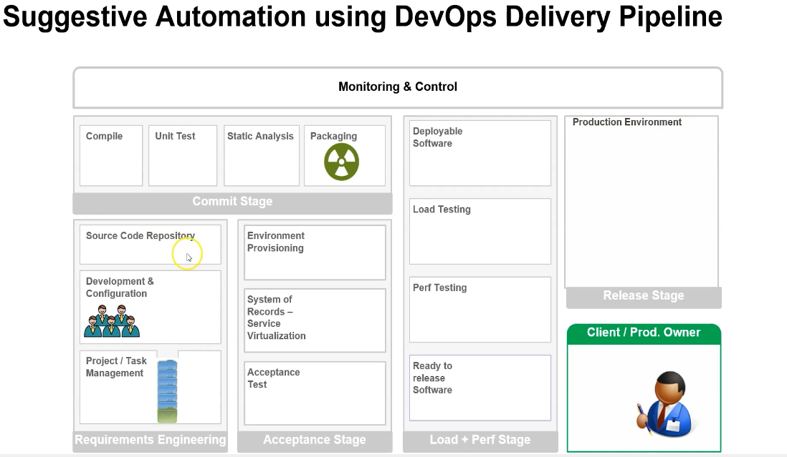

sudo apt-get install openjdk-8*
update-alternatives --config java
whereis java 
find /usr/lib/jvm/java-1.8* | head -n 3
vi /etc/environment
source /etc/environment
vi ~/.bash_profile
echo $PATH
cd /opt/apache-maven-3.9.6/
pwd
vi ~/.bash_profile
```
JAVA_HOME=/usr/lib/jvm/java-1.8.0-openjdk-amd64
M2_HOME=/opt/apache-maven-3.9.6
M2=/opt/apache-maven-3.9.6/bin
PATH=$PATH:$HOME/bin:$JAVA_HOME:$M2:$M2_HOME
```
#### TOMCAT INSTALLATION

```
* sudo groupadd tomcat

* sudo useradd -s /bin/false -g tomcat -d /opt/tomcat tomcat
* https://tomcat.apache.org/download-90.cgi
* cd /tmp
* curl -O https://dlcdn.apache.org/tomcat/tomcat-9/v9.0.56/bin/apache-tomcat-9.0.56.tar.gz
* sudo mkdir /opt/tomcat
* sudo tar xzvf apache-tomcat-9*tar.gz -C /opt/tomcat --strip-components=1
* cd /opt/tomcat
* sudo chown -RH tomcat: /opt/tomcat
* sudo sh -c 'chmod +x /opt/tomcat/bin/*.sh'
* sudo update-java-alternatives -l
* sudo nano /etc/systemd/system/tomcat.service

[Unit]
Description=Apache Tomcat Web Application Container
After=network.target
[Service]
Type=forking
User=tomcat
Group=tomcat
Environment="JAVA_HOME=/usr/lib/jvm/java-1.11.0-openjdk-amd64"
Environment="JAVA_OPTS=-Djava.security.egd=file:///dev/urandom -Djava.awt.headless=true"
Environment="CATALINA_BASE=/opt/tomcat"
Environment="CATALINA_HOME=/opt/tomcat"
Environment="CATALINA_PID=/opt/tomcat/temp/tomcat.pid"
Environment="CATALINA_OPTS=-Xms512M -Xmx1024M -server -XX:+UseParallelGC"
ExecStart=/opt/tomcat/bin/startup.sh
ExecStop=/opt/tomcat/bin/shutdown.sh
[Install]
WantedBy=multi-user.target


* sudo systemctl daemon-reload
* sudo systemctl start tomcat
* sudo systemctl status tomcat
* sudo nano /opt/tomcat/conf/tomcat-users.xml


<?xml version="1.0" encoding="UTF-8"?>
<tomcat-users>
  <role rolename="manager-gui"/>
  <role rolename="manager-script"/>
  <role rolename="manager-jmx"/>
  <role rolename="manager-status"/>
  <role rolename="admin-gui"/>
  <role rolename="admin-script"/>
  <user username="admin" password="Your_Password" roles="manager-gui, manager-script, manager-jmx, manager-status, admin-gui, admin-script"/>
</tomcat-users>

```
* cd /var/lib/jenkins/workspace/taxi-booking/taxi-booking/target
* cp taxi-booking-1.0.1.war  /opt/tomcat/webapps/
* sudo systemctl start tomcat

taxi-booking 
service.html
cars.html
drivers.html
garage.html
 


### youtube 
* Configuration panale 
* Build queue
* Build executer status panale
* u want to see users then __people__ option
* My view u have multiple jobs and u want to  see difreant views then use  __my view__
* New View want to create new view
* Search bar u can use as a navigation bar u want to search the build with num and last faild build or last success build or last stable or last unsuccessfull build may thing && u want to go any configure system or manage plugins like that 

### manage jenkins 

* configure system
  * any pulgin installed and u want to change any plugin related configuration
* Global Tool Configuration
  * any tool configure
* manage plugin
  * add remove any plugin
* configure global security
  * give user to sing or not access jenkins or not
* manage credential
  * u can store the credentials and u can use them in jobs
* manage users
  * u want add or remove the user and modifi the user that can loginto jenkins
* download __role based  authorization strategy__ this plugin is use for when u create the user the user can access any ones project and they can do any thing for that we have to install this plugin __role based  authorization strategy -> configure globale security -> in authorization select the role based strategy__ then u will see the option in manage jenkins manage role and assign roles
* manage jenkins -> manage and assign roles -> role to add -> role name <developer>  and select the options 	 then  __Assigen Role__  -> user/group to add and user name <rizwan>  -> select the permission developer
* we  have multiple user and we want to give permission to specicific project for that we need go manage jenkins -> security -> authorization (project based matrix autharization strategy ->  then we have to add user and select the specifi role to them like read update or delete -> )overall , credentials , agent , job , run , view, scm then go to specfic prject  -> enable project-based security  then u can select the option read build like that 
* we have  A-team and B-team we want to give access to A-project to A-team and B-project to B-team for that we have to use -> manage jenkins -> security -> authorization (project based martrix autharization startegy > then u have to add group A_team and B_team then give the access like read or delete many thing ->)

#### jenkins job

##### Source Code Management
  * we have to download plugin then it will show that plugin option and u have to select that plugin

###### Build Triggers
* when u Build the job u have to doit maually but there is option like Build Triggers without manual intervention
* __Trigger builds remotely (e.g from scripts)__
  * Use the following URL to trigger build remotely: JENKINS_URL/job/demo-4/build?token=TOKEN_NAME or /buildWithParameters?token=TOKEN_NAME
  * http://localhost:8080///job/demo-4/build?token=myjob
  * if u want to execute the jenkins job with the help of shell script u can use __Trigger builds remotely (e.g from scripts)__
  * when we try to trigger job from terminal with URL?token=TOKEN_NAME we get error like authentication Token error to resolove this we need to download the plugin
  * plugin jenkins __Build Authorization Token Root__ install this plugin
  * then u have to search the jenkins plugins in that __Build Authorization Token Root__ u will find token url how to call from curl  or browser
  * buildByToken/build?job=RevolutionTest&token=TacoTuesday modifi with job name and token __http://localhost:8080/buildByToken/build?job=demo-4&token=myjob__
  *  if u want  to  call from terminal u have to use \& __http://localhost:8080/buildByToken/build?job=demo-4\&token=myjob__
* __Build after other project are built__
  * we have job for git clone another one bulid another one deploy once clone is complete then build job will trigger once build job success then deploy job will trigger 
  * in this we have multiple options like build stable or unstable or build fails or build aborted
  * unstable advane -> exit code to set build unstable -> in shell script exit 10 if u get exit code more than 10 declare unstable  
  * we can choose multiple jobs if multiple any one job success it will trigger this job
  * up-stream job before this job trrigers that job will run then this job will triger
  * down-stream job after this job after this jobs run then other job will trigger __H/2****__
###### Build periodically
  * if u want to run job every 2 mints like then we can use this trigger 
###### GitHub hook trigger for GITScm polling
  * if any thing happen in SCM like code commit or push like then it will trigger the job with help of hooks concept in git there is concept like git webhooks 
###### Poll SCM 
  * Poll SCM use any SCM link like git then __H/2****__ it will check the every 2 mints SCM repository if there is any new code it will trigger the job if there is no new code it will not trigger any job

 
* 11. in jenkins delete workspace before build starts  it will clear the workspace before build starts and u can select the advance option for delete the particular pattren files and directory 

###### Environment Variable

```
name=Basha
echo "hello my name is ${name}"
```
* by default jenkins give some Environment Variables u can see them jobs -> select the job -> build -> see the list of avilable environmet variables (BUILD_NUMBER, BRANCH_NAME, TAG_DATE, BUILD_ID ETC.....)

```
# name=Basha
# echo "hello my name is ${name}"

echo "demo-ENV build number is = ${BUILD_NUMBER}"
# ${BUILD_NUMBER} its a default jenkins Environment Variable
```
* when u build ur job u will get some artifacts u have to store those artifacts into some repository u have multiple artifacts its dificult to find which artifats for that u can use ENV __BUILD_NUMBER__ it will store the artifacts with build number
* when u build code in jenkins and that code comes from git and u want to identify the commiter name for that u have jenkins ENV __GIT_COMMITTER_NAME__

###### GlOBAL VARIABLES
* u have to create Global variables wich will use in multiple jobs manage jenkins -> configure system -> global properties  -> click Envoironment variable -> Name = GLOBAL_var Value = mytestGlobalvar then u can use this GLOBAL VARIABLE in ur multiple jobs
* u have some value that requeied for multiple job without going into every job and writing and if need to be some changes in feature u dont need to go every job u can use jenkins GLOBAL VARIABLES u just change in one place it will refleact in every job where u mention that variable
* any parameter or any variable is same for multiple project and u want to use that and in feature it will change u dont need to go every project u just change in global variable place


###### USER DEFIENED VARIABLES
* The parameters that a user should provide when triggering the Pipeline.
* BUILD WITH PARAMETER
* job -> This project is parameterized  -> boolean, choice, credential, multiline string, passwdord, run, string. 

* u have run the project and that goes infinite loop and it will not come out so u loose one executer so how u can set certain time for project come out after some time like it will take too long time but we can set time if this job goes more than specific time it will abort or fail 
* __Build Environment__ -> abort the build if its stuck -> timeout minutes 

###### ENABLE/DISABLE JOB
* u dont want to build the specific job or any job becouse is there any maintaincemode for jenkins server or there is no slave servers and u dont want to run any new job or specific job for that u can go specific project up-right side u will finde option like disable and u can enable

* __Parallel build__ u have one job and u want to run mutliple times parallely by default it will build with que like first build then second build but u want to parallely so go to jobs -> click execute concurrent builds if necessary
*  __retry count__ u can give number like 3 it will try for 3 times
* __Throttle Build__ u want to build only 4 build in 1hour time time period, u cant build the job more than 4 in 1 hour time for this option u have to install plugin __Branch API Plugin__

* __WORKSPACE__ when ever u create job in jenkins it will create one workspace with job-name then u do anything like code clone build all this will store in that workspace 
* Custom Workspace __/var/lib/jenkins/workspace/job-name__
* if u want to change the default workspace to custom workspace 
* __job -> general -> use custom worspace -> give directory path__
* u have multiple jenkins servers and it mounts nfs server u want to use that mount path then use custom workspace

* __Block build when upstream project is building__  u have parent and child jobs when upstream(parent) job is running and some one try run downstream(child) job it will not run it will be in pending state once upstream job done then only downstream job will run
*  __Block build when downstream project is building__ u have parent and child jobs when downstream(child) job is running and some one try run upstream(parent) job it will not run it will be in pending state once downstream job done then only upstream job will run

* plugins 
  * maven integration
  * deploy to container
  * code pipline
  * Copy Artifact
* when u install jenkins plugin it doesnt mean that u have installed maven application u have to install maven application manually or in jenkins -> manage jenkins -> Global Tool Configuration -> maven install automatically and version
*__tomcat9__ location for war file __/var/lib/tomcat9/webapps/ROOT/__ 
* user configuration in tomcat9 __/etc/tomcat9/tomcat-users.xml__ in that u have to past like 

```
<role rolename="manger-gui"/>
<user username="tomcat" password="s3cret" roles="manager-gui,manager-script,mnager-jmx,manager-status"/>
```
* service tomcat9 restart
* __Paralell Build__ manage jenkins -> configure system -> # of executors -> 
* we run multiple jenkins jobs as a paralell build like multiple jobs at a time maybe u get running out of memory or jenkins will crash for that we have concept called __Jenkins MASTER / SLAVE__ 
* __Distrubuted Build__ when ever u run any job it will distrubeted to slave node is there any node is available and the node is helaty or not will check by master node 
* u can run any job in master also but its not gud practice 
* __ADD SLAVE NODE__ manage jenkins -> __Manage Node and Clouds__ -> new node -> name -> permanent Agent ->  # of executors -> remote root directory -> __Labels__ -> us as much as possible
* __launch agent__ for launching the agent slave node should have java 
* __sudo mkdir /var/jenkins__
* __chown basha:basha jenkins/__
* __ls -l__
* if u want to run specific job into specific Slave Node u have to use lables when we configuring slave node we give label and in our project configuration __Restric Where this project can be run__ -> lables Expression 
* why we use lables becouse we have multiple os's like windows linux many thing we have projects like some of runs only windows some of runs only linux for that we can use lables 

* why we need pipline as a code?
* when we build the pipline as a freestyle project we need to build multiple jobs like code pull, code test, code build, artifact store, deploy to deploy one project we need to build multiple project  and its very hard to maintain for that we need pipline as a code  
* we can store our pipline as a code into our code repository and we can maintain versioning 

###### Pipline as Code 
```
pipeline {
    agent any
    stages {
        stage('Example') {
            steps {
                echo 'Hello World'
            }
        }
    }
}
```

```
pipeline {
    agent any
    stages {
        stage('CODE-PULL') {
            steps {
                sh '''
                echo 'Hello World'
                sleep 10
                date
                '''
            }
        }
        stage('TEST') {
            steps {
              echo 'Hello World'
              sleep 10
            } 
        }
        stage('BUILD') {
            steps {
                echo 'Hello World'
                sleep 10
            }
        }
        stage('DEPLOY') {
            steps {
                echo 'Hello World'
                sleep 10
            }
        }
    }
}

```

* New Item -> pipline -> general 
                             * enable project-based security
                             * discard old builds
                               * when we run jobs it will generate console output and archived artifacts and any other metadata  so keeping all the jobs data will consume lot of space for that we can use __discard buids__ we can choose option like __1.Build age: discard builds when they reach certen age__ __2. Build count: discard the oldest build when certian number of builds already exist__ 
                             * do not allow concurrent builds
                               * I do not want to allow two jobs of the same type (same repository) to run in parallel on the same node.
                               * when we click build now multiple time it will build paralelly for multiple times it doesnt mean to build same job and same branch same repository run multiple times it will consume multiple executor for that we can use option like  __do not allow concurrent builds__ in pipline __diseble concurrent builds__ 
                               * when u select this option in que job#1  is completed then other  que job#2 will run 
                             * do not allow the pipline to resume if the controller restart 
                             * gitHub project 
                             * pipline speed/ durability override 
                             * preserver stashes from completed builds
                             * theis project is parameterized 
                             * throttel builds 

* __Restrat a jenkins pipline from stage__ when we runing our jobs as a pipline we have multiple stages like code pull and code build and code test and code deploy in this stages u want to rerun any stage we can any stage faild we can rerun prticulor stage 
* You can restart any completed Declarative Pipeline from any top-level stage which ran in that Pipeline. This allows you to rerun a Pipeline from a stage which failed due to transient or environmental considerations, for example. All inputs to the Pipeline will be the same. This includes SCM information, build parameters, and the contents of any stash step calls in the original Pipeline, if specified.

```
pipeline {
    agent any
    stages {
        stage('CODE-PULL') 
        stage('TEST') {
            steps {
                sh 'echo "${BUILD_ID}"' // jenkins environment

            }
        }
    }
}
```

* __user Defined Varaibales__

```
pipeline {
    agent any
    environment {
      name= 'BASHA'
    }
    stages {
        stage('CODE-PULL') {
          environment{
            name= 'basha'
          }
            steps {
                 sh 'echo "${name}"' // user-defined  environment at stage level 
                    }
                    }

        stage('TEST') {
            steps {
                sh 'echo "${name}"' // user-defined  environment

            }
        }
    }
}
```

* u can give environments at pipline level and at stage level 

* __Build with Parameter__

```
pipeline {
    agent any
    environment {
      name= 'BASHA'
    }
    parameters {
      booleanParam(name: 'ismale', defaultValue: true, description: "")
      choice(name: 'city', choices: ['jaipur','Mumbai','pune'], description: "")
      string(name: 'person', defaultValue: 'Rizwan', description: "give the ur name")
    }
    stages {
        stage('CODE-PULL') {
          environment{
            name= 'basha'
          }
            steps {
                 sh 'echo "${name}"'// user-defined  environment at stage level 
                 sh 'echo "${city}"'
                    }
                    }

        stage('TEST') {
            steps {
                sh 'echo "${name}"' // user-defined  environment

            }
        }
    }
}
```
* u can build the job with parameter 

* if u want to manual intervintion like manualy user want to give some input u can use but it stage level only 
* user want to continue the stage they can use __input__ option 

```
pipeline {
    agent any
    environment {
      name= 'BASHA'
    }
    stages {
        stage('CODE-PULL') {
          environment{
            name= 'basha'
          }
            steps {
                 sh 'echo "${name}"' // user-defined  environment at stage level 
                    }
                    }

        stage('Contuine or abort') {
            input {
              message "should we continue?"
              ok "yes we should"
            }
            steps {
                sh 'echo "${name}"' // user-defined  environment

            }
        }
    }
}
```

* usually jenkins run every stage one after  other if any stage fails it wont run next stage but u have requrement like any stage fail dont consider always run the particulor stage for that we need to use __post__
* __post__ option we can use stage level and complete pipline level 
* if any stage fails send notification like that 
```
post {
  always {
    echo 'I will always say hello again!'
  }
  failure{
    echo 'if any stage fails'
  }
  success{
    echo 'only when pipline success if any stage aborted that time also not run this stage all pipline success then only this will run'
  }
}
```
* Some actions like sending notifications and saving logs and running other piplines 

```
pipeline {
    agent any
    environment {
      name= 'BASHA'
    }
    stages {
        stage('CODE-PULL') {
          environment{
            name= 'basha'
          }
            steps {
                 sh 'ech "${name}"' // user-defined  environment at stage level 
                    }
                    }

        stage('Contuine or abort') {
            input {
              message "should we continue?"
              ok "yes we should"
            }
            steps {
                sh 'echo "${name}"' // user-defined  environment

            }
        }
    }
post {  // post action always run if any stage fail or success it doesnt consider
  always {
    echo 'I will always say hello again!'
  }
}
}
```

47. 

* we have pipline with multiple stages like 20 stages when we run the pipline it fails 19 stage and it take 2 hours to come at 19th stage so u did some changes in pipline and u run again but it fail again so for that we dont need to run every stage beacouse it consume lot of time for that we can run only 19th stage by using __blue ocean plugin__ and __Declarative pipline__
* __blue ocean plugin__ when u run job it will show the every stage if any stage fail click on that stage there is option like restartstagename
* Scripted pipline u cant restart any stage 
* Declarative pipline u can restart any stage at any time 

* we can write jenkins pipline or pipline syntax generator or blue ocian 
* while writing jenkins file how can u mention that maven install it means maven autometically will installed by jenkins 


```
 pipline {
  agent any 
  tools{
     maven 'apache-maven-3.0.1'
  }
  stages {
    stage('example') {
      steps {
         sh 'mvn --version'
      }
    }
    }
 }
```
###### Jenkins Slack Notification
```
pipeline{
    agent any
    stages{
        stage("GIT CODE PULL"){
            steps{
                slackSend channel: 'jenkins', color: 'good', message: "Build Started: ${env.JOB_NAME} ${env.BUILD_NUMBER}"
                slackSend channel: 'jenkins', color: 'good', message: "GIT CODE PULL STAGE STARTED"
                echo "========GIT CODE PULL====="
            }
            post{
                always{
                    echo "========always========"
                }
                success{
                    echo "========A executed successfully========"
                }
                failure{
                    echo "========A execution failed========"
                }
            }
        }
        stage("CODE TEST"){
            steps{
                echo "========CODE TEST====="
                slackSend channel: 'jenkins', color: 'good', message: "CODE TESTING STARTED"
            }
            post{
                always{
                    echo "========always========"
                }
                success{
                    echo "========A executed successfully========"
                }
                failure{
                    echo "========A execution failed========"
                }
            }
        }
        stage("CODE BUILD"){
            steps{
                echo "========CODE BUILD====="
                slackSend channel: 'jenkins', color: 'good', message: "CODE BUILDING"
            }
            post{
                always{
                    echo "========always========"
                }
                success{
                    echo "========A executed successfully========"
                }
                failure{
                    echo "========A execution failed========"
                }
            }
        }
        stage("CODE DEPLOY"){
            steps{
                echo "========CODE DEPLOY====="
                slackSend channel: 'jenkins', color: 'good', message: "CODE DEPLOYING"
                // for deploying on container we need to install deploy on container plugin 
                deploy adapters: [tomcat9(credentialsId: 'Tomcat', path: '', url: 'http://192.168.0.1:8080')], contextPath: 'app', war: '**/*.war'
            }
            post{
                always{
                    echo "========always========"
                }
                success{
                    echo "========A executed successfully========"
                }
                failure{
                    echo "========A execution failed========"
                }
            }
        }
    }
    post{
        always{
            echo "========always========"
        }
        success{
            echo "========pipeline executed successfully ========"``
        }
        failure{
            echo "========pipeline execution failed========"
        }
    }
}
```

```
   stages{
    stage('helo') {
        when {
          equals expected: 3, actual: 'b'
          // if expt and actu are not matching this stage will skiped
        }
      }
    stage('helo') {
        when {
          equals expected: '3', actual: env.BUILD_ID
          // when we use env varibles we need to use '3' beacouse string 
        }
      }
    }
```
* when u want to skip or do something in jenkins pipline we can use __tag__ option 
* we have multiple environments and we want to deploy our application in diffreant environment for that we can use jenkins pipline in that we can use tags like when tag if dev this stage will run when tag if stage is qa this stage will run  

```
pipeline {
    agent any
    stages {
        stage('Build') {
            steps {
                sh 'make package'
            }
        }
        stage('Test') {
            steps {
                sh 'make check'
            }
        }
        stage('Deploy') {
            when { tag "release-*" } 
            // This means the stage would only execute when the Pipeline has been triggered from a tag in Git matching the release-* Ant-style wildcard.
            steps {
                echo 'Deploying only because this commit is tagged...'
                sh 'make deploy'
            }
        }
    }
}

```


* CAN we have multiple agents in jenins pipline ?
* yes we can run multiple agents 
* we can run agents at pipline level or every stage level
* we can have multiple labels for single agent 
* in jenkins pipline we can use condition like

__agent { label 'node1 || node2' }__ job will run node1 or node2 wich ever node is available 
__agent { label 'node1 && node2' }__  it will node1 and node2 who has lable like that if any node dosnt have this cobination job will start but never finished  [nodelabel node1 node2] we can give single node to multiple labels 

```
pipeline{
    agent none

    stages{
        stage("A"){
            agent { label 'node1'}
            steps{
                echo "========executing A========"
            }
        }        
        stage("b"){
            agent { label 'node2'}
            steps{
                echo "========executing b========"
            }
        }
    }
}

```

* __NODE LABEL__ if u doesnt want to use default workspace u want to use custom workspace then u can use __NodeLabel__

```
pipline 
  agent {
    node {
      label 'node1'
      customWorkspace '/home/basha/my-custom-workspace'
    }
  }
```
* what is meaning of agent any?
* it means any agent availbel 
* first time it runs in node1 and u run other time it will run same node1 becouse it remember the whre first job runs its run same node until same node goes offline

* how to disconnect agent ? 
* we have multiple jenkins nodes and some of node we want to put in maintains mode like any update that kind of thing for that we need to disconnect 
* manage jenkins -> nodes -> select node -> Disconnect -> markthis node temporarily offline  once done MM 
* select the node -> bring this node online -> launch the agent 
* if doenst mark this temporarily offline when u refresh or restart it will come to online 

* Retain Builds Forever?
* currentBuild.keepLog = true
          // it will keep the build forever it diseble delete build '#2'

```
pipline {
  agent any
  stages{
    stage('hello') {
      steps{
        script {
          currentBuild.keepLog = true
          // it will keep the build forever it diseble delete build '#2'
        }
      }
    }
  }
}
```

* Resume jenkins job in jenkins when we run the job if any stage jenkins server restarted job will be resume where ever its stoped 

* Run Different steps in jenkins pipline based on branch 
* we have multiple branch in git and we want to run our jenkins job for every stage for particulor branch

```
pipline {
  agent any
  stages {
    stage('for main branch') {
      when {
        branch 'main'
      }
      steps{
        echo 'main branch'
      }
  }
  stage('for stage branch'){
    when {
        branch 'stage'
    }
    steps {
        echo 'stage branch'
    }
  }
  stage('for pull request') {
    when {
        changeRequest()
    }
    steps {
        echo 'pull request'
    }
  }
}
}
```
* how to change jenkins folder 

```
pipeline{
    agent any
    stages{
        stage('full path'){
            steps{
                sh 'cat my-project/file.txt'
            }
        }
        stage {
            steps {
                dir('my-project'){
                    sh 'cat file.txt '
                }
            }
         }
        } 
       }
```
* how to change jenkins port?
* ps -a 
* systemctl edit jenkins
* __cd /usr/lib/systemd/system/__
* __ls *jenkins*__
* __sudo vi jenkins.service__

* how to reset jenkins admin passsword?
* __systemctl stop jenkins__
* __cd /var/lib/jenkins/__
* __vi config.xml__ 
* __<useSecurity>true</useSecurity>__ to __<useSecurity>false</useSecurity>__  take backup before making any changes in this file 
* __systemctl start jenkins__
* manage jenkins -> configure global security -> security Realm -> none to jenkins own user database -> allow user to sign up? uncheck 
* goto people admin -> configure -> password new password 
* manage jenkins -> configure global security -> anyone can do anythoing to logged-in user can do anything -> uncheck allow anonymous read access?

* trigger the job (downstream job)

```
pipline {
  agent any
  stages {
    stage('hello') {
      steps {
        echo 'hello friends'
      }
    }
    stage('trigger job2) {
      steps {
        build 'job2'
      }
    }
  }
}
```
* jenkins some jobs are running and that time i want to restart the jenkins server ther is a option like __/restart__ or __/safeRestart__  
* __/restart__ imidiatly it will restart the jenkins 
* __/safeRestart__ it will wait to finish the jobs which are running once all jobs are completed then only it will restart 

* discard old build in pipline
```
pipline {
  agent any
  options {
     buildDiscarder logRotator(artifactDaysToKeepStr: '10', artifactNumToKeepStr: '10', daysToKeepStr: '', numToKeepStr: '3')
}
  stages {
    stage('hello') {
      steps {
        echo 'hello friends'
      }
    }
  }
}
```

* when we pull the code from git jenkins default checkout scm u dont need to specifi that u can also do __skipDefaultCheckout true__ 

* __Throttle__ when we run the job we want to wait to trigger other job like once the job is completed and wait for 1 minute to trigger next job  
* 

* how to increase git clone timeout in jenkins pipline?

* what is diffreance between scripted vs declarative pipline?

* when u use declarative pipline by default it will checkout SCM  but scripted not 
* when u using declarative u get  a option like restart from stage  (restart from stage means u have 10 stages and u want to start ur job stage5 it will skip the 1,2,3,4 stage it will start from 5th stage)
* when u use scripted there is no restart from stage 

* how to use jenkins lockable resources?
* when we run the jenkins job multiple time it run job when u use lockable resources it will wait complete the job1 once job1 is completed then job2 will run  but we can get this option in throttel in throttel there is quit period it will wait some time in betweent the jobs once job1 is completed it will wait some seconds then run job2 
* lockable resources u need to install plugin and  -> manage jenkins -> configuration -> lockable resources -> name  my-unique-resource -> description -> Labels agent1 -> reserved by (when we doing some sort of maintains for that no job will run for that u have to reserve once done maintance )

```
pipline {
  agent any 
  stages {
    stage('hello') {
      steps {
        lock('my-unique-resource') { // configuration -> lockable resources name -> my-unique-resource          sh 'echo hello world'
          sleep 60
        }
      }
    }
  }
}
```

* deleteDir() it will delete the current directory and its content  in that files 

* Parallel pipline 

```
pipeline{
    agent none
    stages {
        stage('BuildandTest') {
            parallel {
                stage('macos') {
                    agent {label 'macos'}
                    stages {
                        stage('Build') {
                            steps{
                                sh 'echo do build for macos'
                            }
                        }
                        stage('Test'){
                            steps {
                                sh 'echo do test for macos'
                            }
                        }
                    }
                }
                stage('linux') {
                    agent {label 'linux'}
                    stages {
                        stage('Build') {
                            steps {
                                sh 'echo do build for linux'
                            }                        
                            }
                        stage('Test') {
                           steps {
                            sh 'echo do test for linux'
                           }
                        }
                    }
                }
            }
        }
    }
}
```
* we have  mulitple nodes and we want to run our jenkins pipline as a paralelly into 2 nodes in paralelly like 
macos build and test deploy 
linux build and test deploy 


* jenkins backup 

* how to safely upgrade jenkins to a new version?
* install plugin __support-core__   

* schedule a jenkins job to run evry hour?

```
pipline {
  agent any
  triggers {
    cron '* * * * *'
  }
  stages {
    stage('hello') {
      steps {
        sh 'echo hello world'
      }
    }
  }
}
```
* when ever u create job first time u need to manually trigger the job then only it will run every time 

* git Support for password authentication was removed on aug 13 2021 use personal access token instead.
* settings -> developer settings -> personal access tokens -> select options generate token -> copy token -> in jenkins add credentials -> username [mail.com] -> password -> id -> add 

* in jenkins we can make our success job to as failure using __currentBuild.result = 'FAILURE'__


```
post {
  success {
    script {
      currentBuild.result = 'FAILURE'
    }
  }
  }
```
07-12-2023

* how to setup docker container as build agents for jenkins
* install plugin __docker pipline__ 

```
pipline {
  agent {
    docker { image 'node:16-alpine' }
  }
  stages {
    stage('test') {
      steps {
        sh 'node --version'
      }
    }
  }
}
```

* when u use docker image as a jenkins agent it will look is there any docker image u called if any image is not present in local it will pull form public repository and create a container and will perform all stages once completed it will stop the container and remove the container 
* we can use docker container as a jenkins node at globale level or every stage level 

================================================================================================================================================

#### DEVOPS




##### DevOps Lifecycle


* What is The Version Control System?
* A system that keeps records of your changes ur doing any changes to ur code it is tracking/record  those changes 
* if u use VCS its allows to u know who made what changes & when 
* Allows u to rever any changes 
* __Version Control System Types__
* __Local__
  * local computer its record what changes have made by me and when and it alway point to latest changes if u want to go back previous u can go 
  * __Local Version Control System__ works if u are a single developer or u dont want to colabrate team 
* __Centralized Version Control System__
  * CVCS u have centralized repository  or main server repository and collaborator and developers communicate with main server repository 
  * u dont have any local copi of ur code in centralized repository 
  * in case centralized repository not accessble developer could not write the code becouse Centralized repository alway accessble 
  * centralized repository is sloves the problem to work with group of people if any case centralied repository is not accessble it is a problem for developer or colbarator
* __Distributed Version Control System__
  * widly use this DVCS it has main server repository and local repository like what ever code having in main repository same available in local repository u can sysnc local and main and developer continue to write the code if main repository goes down becouse same code available in local repository 
  * before pusing ur code remote u have to push local repository and if u dont have local and remote repository other colabrator can have same code  they can push code from there local to main server repository from there everybody in team can access the code 
  


* git config --list (it will list all the  git configuration) 
* how to become folder as a git repository using __git init .__


 
* __git diff__ it will show the changes between working area and staging area a stand for working area  b stands for staging area 
* to compare staging  area to local repository __git diff --staged__ 
* __git diff HEAD__ it will compare with working area with local repository 


* __git diff 2342fd3 24fef33__ u want to compare with 2 commits difreance between 2 commits 


* __git clone__ if repository not exists in ur system then we need to use __git clone__
* __git pull__ repository already available and few changes u want to pull from remote repository 

* __Connecting to github using SSH__
* generate the ssh key 

* __ssh-keygen__
* __cd /root/.ssh__  copy __id_rsa/pub__ on to github account 
* __eval $(ssh-agent -5)__
* __ssh-add ~/.ssh/id_rsa__ add ssh private key to agent 

* if u wan to see diffreance betweent 2 commits __git diff 3fafcf3 ff32rfdf__ 
* __git diff HEAD HEAD~1__ previous commits
* __git diff HEAD HEAD~2__ previous commits 
* u have writen a working application but after few commits application got currepted u dont know who has commits those bugs for that u can use __git log__ but u want to see specific file who has done the chnage 
__git annotate jenkins_dockerfile__
* if u want to identifi with git log command who has done this change then we need to got to each commit and check what files he has modified 
* if u want to go back prevoius commit we can use __git checkout commitid__
* when ever 2 developer trying to update same file and same line of code then merge confilict happen to reslove this whoever is created this merge conflict they have to sit togather and understad that wich commit should go into git repository thos commits they have to do 

* __Protected Branch__ we have multiple branches in our git repository and maste/main branch is connect to production for that we dont want to mess up with this branch like if contributer/owner  push the code into master/main branch directly if any bug we loose production for that before pushing this branches first it has to go to some reviwe process to review the code then only it should get commited again it comes as pull request  

* __Protected Branches__ github -> settings -> branches -> add Branches protection rules -> name branch -> click -> require pull request reviews before mergng(required approving reviews.3) / require status check to pass before merging / include administrators -> create 

*  __git Tags__ tags are ref's that point to specific commit in git history.
* usaly we create tag to refs to a specifi commit wich is working fine 
* working on project after doing multiple commints i have created a bug free code it has some commit id wich is not for me to remember the i tag  that as a userfrendly name so that it is for me to remember 
* tagging is generally used to capture a piont in history that is used for marked version release 
* a tag is like a branch that doesnt change 
* __git tag__ list of tags 
* __git tag v1.0__ at  this time what ever code in branch it is going to tag it as v1.0 
* __git push origin v1.0__ to push tags to remote repository 
* __git tag -a v1.1 2413rfjoi -m "version 1.1 which works with customer potal"__ 
* __git push origin v1.1__

* __REVERT CHNAGES__


 __Rever changes from working directory__

```
git restore <file_name>
git checkout --<file_name>
```
* NOTE: even u can remove changes manually. but f we have update multiple files and dont know which lines to remove this command really helps 

__Rever changes form Staging area__

```
git restore --staged <file_name> # to revert canges from staging area to working directory 
git restore <file_name> # revert changes fromworking directory 
```
__Rever changes from Local Repository if u havent commited in to remote repository__

```
git reset HEAD~  # to revert chnages from local repo to working directory 
git reset HEAD^2 # two commits back 
git restore <file_name(s)>  # to rever changes from working directory
```

__Rever changes from remote repository__

we dont have direct way to do this  

__GIT REBASE__

* git rebase we use we want to squeze multiple commite into one commite like i have 5 commite i dont want to push those 5 commits into my repository the i can convert those commits into a single commit 

* __git rebase -i HEAD~4__

```
pick 3432432 added number 2 
squash wre3edf added number 3
squash rerfcee added number 4
squash wfcerfe added number 5
```
* 3 commits add into number 2
* add commit message
* git log 


* __git pull__ pull the changes from remote repo to local system, if any chnages in remote repo thos get updated in our local repo at the same time the content updated in remote repo same content get pulled into local repo and working directory 
* __git featch__ it going to sync with remote repo to local repo but u cant see the changes of remote repo files in our woring directory if u wnat to get those changes into local directory again u need to execute __git merge__ command 

* __git pull__  = __git featch + git merge__


* devops engineer, can u create a repository for new project?
 


* when ever u create git remote repository it will create default master branch if u want to delete the default master branch first u need to create onother branch and make that branch as a defaut branch then  only u will  delete master branch 

* repository -> branch -> change defult branch -> scrol down -> selecte branch -> udate 
* create protection to  branches -> branch -> branch protection rules -> add rule -> branch name pattren -> click -> require pull request reviews before merging (required approving reviews:2) -> create 

* add colaborater -> settings -> manage access -> add co

llaborater -> invaite a collaborater -> 


* we have source code but we cant deploy our source into application server for that we need to compile our code then only we application system understand 


#### MAVEN
* maven can able to download the all third party libraries whcih are requered for ur application and it also do the compilation, test, even deployment of application not only this if any update in third party libreies or package whcih are u using  u just need to update that file its autometcally downloads when ever ur compiling or testing ur code 
* maven can help us build our application with all requierd packages with the minimal effort 
* sharing only source code for community or people who ever want to us ur application allong with the file wich mention that what libreis doest it requier that file we callit as __pom.xml__ 


* __MAVEN BUILD LIFECYCLE__
1. Default
  1. validate
  2. intialize
  3. generate-sources
  4. process-sources
  5. generate-resources
  6. process-resources
  7. compile
  8. process-clasess
  9. generate-test-sources
 10. test
 11. package
 12. verify
 13. install
 14. deploy
2. Clean 
  1. pre-clean
  2. clean
  3. post-clean
3. Site ( we dont use it is for documentation purpose )
  1. pre-site 
  2. site
  3. post-site
  4. site-deploy


* __POM.XML__  Project Object Model it is an xml file it contains information about the project  and configuration details used by maven to build the project , it contains default values for most projects.
* it teling about inforamation what project does do what is artifact id and version and also configuration which u need to execute the project and it also contain default value which are requierd to that project 

* __Transitive Dependency__ when ever u callin some dependencies in pom.xml it will bring some more dependencies that is called transitive dependency.

* __LOCAL REPOSITORY__ VS __REMOTE REPOSITORY__
* when ever we run maven project first time it is going to create a local repository by default local repository get created __users/basha/.m2/repository__ when ever we requier any dependencies mention in pom.xml it pull from remote repository to local repository 
* if u want to keeps file into our .m2 directory then we can use __install__ 


JAVE SETUP
* sudo apt install java-1.8*
* java -version
* find /usr/lib/jvm/java-1.8* | head -n 3 
* vi ~/.bash_profile
* JAVA_HOME=/USR/LI/JVM/JAVA-1.8.0-OPENJDK-1.8.0.272.b10-1.amzn2.o.1.x86_64
* PATH-$PATH:$HOME/bin:$JAVA_HOME
* source ~/.bash_profile
* echo $PATH

MAVEN SETUP
* wget tar
* tar -xvzf filename.gz
* /opt/apache-maven-3.6.3
* vi ~/.bash_profie
* M2_HOME=/opt/apache-maven-3.6.3
* M2=/opt/apache-maven-3.6.3/bin
* PATH=$PATH:$HOME/bin:$JAVA_HOME:$M2_HOME:$M2
* source ~/.bash_profile 
* echo $PATH 
* mvn --version

* __settings.xml__ pom.xml assoiciated with specific project if u use that pom.xml other project  may or may not work 
* but __Settings.xml__ is global configuration assume that there are some common values need to provide accrocss ur environment then u can update in __Settings.xml__ file 
* this file configure in 2 locataion 
  * the maven install: __${maven.home}/conf/settings.xml__
    * cd /opt/apache-maven-3.6.3/
    * cd conf 
    * settings.xml
  * A user's install: __${user.home}/.m2/settings.xml__  
    * cd .m2
    * here also u can create by default u cant see settings.xml file but we can create 

Tomcat-installation: https://github.com/ravdy/maven/blob/master/tomcat_installation.MD

Jenkins-installation: https://github.com/ravdy/maven/blob/master/jenkins_installation.MD


* jenkins slav node   
* useradd jenkins
* passwd jenkins
* visudo 
* root ALL=(ALL)   ALL
* jenkins   ALL=(ALL)   NOPASSWD: ALL
* vi /etc/ssh/sshd_config
* PasswordAuthentication yes
* // # PasswordAuthentication no
* service sshd reload 

#### ARTIFACTORY
* when ever developer develop the code its available in sourcecode it is available in readable format
* it is a source code where they develop code and they can use that one build a artifact to build a artifact we need to some activity in between nothing but compilation when ever we compile any source code if source code is fine it is generate the outcome the outcome whcih comes outof source code we callit as artifact 
* we have java code when u build java code u get a .jar or .war or .ear 
* .net we get .exe 
* why do we need artifat why cant we use source code becouse sourcecode is not understandble by ur system, 
* ur system cant understand source code that why we need to convert our source code into system understandble  lanuage 
* if we share source code directly there is possible for every one can use source code and create same application with other name so we loss business 
* when we do compilation the compiler can able to understand source code and it converts into binery(nothing but zero ones) those binery can understand by ur system 
* all the artifact doesnt convert into binerys becouse some binerys or some artifacs understandbe by application 
* when ever u want to install java application u need a some application server  why application server even though jar or war files those are not understandble by ur system directly the application server will understand thats reson when ever we install java application we all going to use application server like tomcat, websepar, web logic all this applicaton server 

* what is artifactory repository?
* we can store outcome of artifacts as well as to build we need some dependencies that dependeices we can store in artifactory like maven remote repository 
* sotre libreis required fo rbuild 

* ./artifatory.sh start
* netstat -tulpn u can see wich ports are using 
* username admin
* password password
* when create repositories in jforg-artifactory with maven it will create   
  1. libs-snapshot-local
  2. libs-release-local
  3. jcenter
  4. libs-snapshot 
  5. libs-release
* artifactory
  1. local    ( )
     * libs-release-local
     * libs-snapshot-local
  2. remote   ( )
     * jcenter
  3. virtual  (combination of loacl and remote)
     * libs-release
     * libs-snapshot
* to intigrate with maven we need update in pom.xml file 
* maven communicate with __libs-release-local__ __libs-snapshot-local__ u need to generate the pom.xml like code or in jfrog artifactory u have feature to generate the code for that __SetMeUp__ -> select tool maven -> generate maven settings -> select repository -> then u will get distrubution management -> copy -> update in pom.xml after dependecy -> 
* what we are saying maven u can build it what ever outcome ur getting that out come u need to store on jfrog artifactory  (<url>http://ec2-12-233-23-103.ap.south-1compute.amazonaws.com:8081/artifactory/libs-snapshot-local</url>)
* we mention jfrog artifactory server details but maven should have access like when we login it will ask username and password for that create new user  -> admin -> new -> maven -> admin privileges -> password -> email -> save ->  use this user to communicate maven to jfrog artifactory 
* to provide the credentials to maven there is file called __settings.xml__ that fie u need to store in __.M2__ folder so that can able to authenticate with artifactory 
* to get __settings.xml__  repositorys -> libs-snapshot-local -> SetMeUp -> generate maven settings ->   generate settings -> it will give snippet copy   ->.me/ vi settings.xml past replace username and password
```
<username>maven</username>
<password>Maven@123</password>
```
* what we are saying to maven use this __libs-snapshot-local__ repository to store snapshots  
* __SetMeUp__ option is very usefull when ever we generate the code which is requeired to communicate with pur tools 
* mvn deploy it create repository and it deploys in the target location 
*  why we storeing artifact into artifatory  we need to maintain version 

* ps -ef | grep tomcat

#### JENKINS 


* the purpose of jenkins to create jobs which u want to execute quit frequently or regulorly it is going to help u achive thos task 

* __GitHub Webhooks__ 
* webhook it will trigger the job when ever github get code from the developer or anyone for that we need to configure in jenkins like __GitHub hook trigger for GITScm polling__ then 
* goto github -> settings -> webhooks -> add webhook -> payload url (jenkins server ip with:8080/github-webhook/) -> content type application/json -> which events would u like to trigger this webhook? -> save 


```
pipeline {
  agent any
  stages {
    stage('timeout') {
      steps {
        retry(3) {
          sh 'I am not going to work it'
        }
      }
    }
  }
}
```
* 3 times it will retry the particulor stage

* __Integrating Artifactory__
* install __artifactory plugin__ 
* configure system -> add artifactory server
serverid - URL/artifactory  -> credentials (u can create users in artifactory server -> admin -> security -> users) -> test connection


* __SonarQube__
* onec developer write the code we need to validate quality code or note quality code nothing but 
  * is it a bug free?
  * is it secure?
  * duplications avoided?
  * tested properly?
  * complex code?
  * esay to integrate with others code?
* __SonarQube__ Static Code Analysis  
* its act as Quality Management Tool
* apart from code analysis it is also gathers the reports various testing  which u are doing  may be unit testing, testing reports, code coverage reports and few other things it is going to collect and display in GUI in very nice understandble formate 

SonarQube-Installation __https://github.com/ravdy/DevOps/blob/master/sonarqube/Setup_SonarQube.md__

* to create token of sonarqube -> administration -> projects -> u can create project or u can delete the project by selecting the projectname -> add project -> project key -> display name setup-> generate token helloworld-project -> generate continue -> select maven copy the execute the scanner for maven from your computer 
* u have to execute where ever ur project is available 


* there is a sonar scanner  its kind of agent for ur sonarqube server it recites on  the system where ever u have source code its runs analysis on source code and generate a report this reports going to share with sonarqube server and it store in the data base when ever u want to retrive the database ur going to use search server like elastic search to retrive the data in the webserver 


Integrate-Sonar-with-Jenkins __https://github.com/ravdy/DevOps/blob/master/sonarqube/integrate_sonar_with_jenkins.md__

* sonarqube credentails -> jenkins manage creddentails ->  jenkins -> global credentails -> add credentails -> credentails type secret text -> 
* add sonaqube to jenkins -> manage jenkins -> configure system -> sonarqube server click environment variable -> add sonaqube -> name and url of sonarqube -> authentication token save 
* install sonar scanner 

* __ANSIBLE__


* Ansible Ad-hoc commands is nothing but just ur executeing tempraly purpose and also it is not repetead work when ever u want to do repetead activity then playbooks u can use  
* __ansible all -m command -a "ls -l"__ this command will execute on ansible nodes on __ansible admin home dir__ 
* __ansible all -m stat -a "/home/ansadmin/testfile"__
* __ansible all -m yum -a "name=git"__
* __ansible all -m yum -a "name=git" -b__ -b stands for become 
* __ansible all -m setup__ __setup__ this ad-hock command will communicate with client  it gather all client information either system level or network level hardware level all this information it gathers and give it to ansible control node 


* what ever u want to do in ansible it will go and check with __ansible.cfg__ file in that file there many default values are there if u want to create ur own .cfg file u can create 
* ansible will look for ansible.cfg file in first 
  * __ANSIBLE_CONFIG (an environmetn varible)__
  * __ansible.cfg (in the current directory)__
  * __ansible.cfg (in the home directory)__
  * __/etc/ansible/ansible.cfg__ it default directory when ever u install ansible it come 


* when we run ansible playbook like having one task in that it will give output like ok=2 but u have only one task why it showing ok=2 becouse when u run playbook bydefault it gathering the facts for that it will take as a  2 task if u dont want to gathering the facts then u have to use  __gather_facts: no__  in playbook 


```
PALY RECAP *******************************************************************************************
172.31.32.233         : ok=2   changed=0    unreachable=0   failed=0   skipped=0  rescued=0  ignored=0
```

* __ansible-playbook create-user.yml --check__ it will check the palybook is correct or not 

```
---
- name: unistall multiple packages
  hosts: all
  become: true
  gather_facts: yes

  tass:
  - name: uninstall packages
    yum:
      name: "{{ item.pkg }}"
      state: "{{ item.setup }}"
    loop:
      - { pkg: 'git', setup: 'installed' }
      - { pkg: 'make', setup: 'latest' }
      - { pkg: 'wget', setup: 'removed' }
      - { pkg: 'tree', setup: 'absent' }

``` 


* client system serving an application then why we need to start the application 
* already application are running why we need to start if start running application custmore will get some interpution
* if it is a production system restarting a  services may distrube ur production environment  to over come this problem if application installing first time then only start the service if service is already running then no need to start the service if changing anything configuration file then only restart service for that we need to use condition called __notify & handlers__ 
* __notify & handler__ if the above task is executed then only execute below task if above taks is not executed then not execute below task 

* __ansible-playbook -i hosts install_httpd.yml --limit webservers --check__


* __ansible-vault create vault.yml__ it ask password to create 
* __ansible-vault view vault1.yml__ it will ask password to open vault1.yml
* if u have file already and u want to create a encrypt by ansible fo that __ansible-vault encrypt user.yml__ it will ask password assign
* __ansible-vault edit user.yml__ to edit user.yml file 
* __ansible-vault decrypt user.yml__ to decrypt user.yml file 
* __ansible-palybook -i host git_colone.yml --ask-vault-passwod__
* __Role Directory Structure__

```
site.yml
webserver.yml
fooseervers.yml
roles/
   common/
     tasks/
     handlers/
     files/
     templates/
     vars/
     defaults/
     meta/
  webservers/
     tasks/
     defaults/
     meta/
```


```

roles/
    common/               # this hierarchy represents a "role"
        tasks/            #
            main.yml      #  <-- tasks file can include smaller files if warranted
        handlers/         #
            main.yml      #  <-- handlers file
        templates/        #  <-- files for use with the template resource
            ntp.conf.j2   #  <------- templates end in .j2
        files/            #
            bar.txt       #  <-- files for use with the copy resource
            foo.sh        #  <-- script files for use with the script resource
        vars/             #
            main.yml      #  <-- variables associated with this role
        defaults/         #
            main.yml      #  <-- default lower priority variables for this role
        meta/             #
            main.yml      #  <-- role dependencies
        library/          # roles can also include custom modules
        module_utils/     # roles can also include custom module_utils
        lookup_plugins/   # or other types of plugins, like lookup in this case

    webtier/              # same kind of structure as "common" was above, done for the webtier role
    monitoring/           # ""
    fooapp/               # ""
```

* if u want to create roles __ansible-galaxy init tomcat__ it will give u directory structure 
* if u want to download roles from ansible-galaxy __ansible-galaxy install zaxos.tomcat-ansible-role__ when u download the roles it store in the location __.ansible/roles__ 
end

##### DOCKER
* six application deploymnet strategies
*  __docker run -it centos /bin/bash__
* __docker run -d -t imagename shell__
* __ps -ef__
* __docker ps -a__
* __docker exec -it 3099rpu09u8320 /bin/bash__
* __ctrl + pq__
* __docker strat 9382ef4rf__
* __docker stop 9382ef4rf__
* __docker run --name some-mysql -e MYSQL_ROOT_PASSWORD=myseceret-pw -d mysql:tag__
* __docker run -it --network some-network --rm mysql mysql - host-mysql - uexample-user -p__ 
* __docker run -d -t --name nginxserver --hostname nginxprod nginx:1.2__ nginxserver is container name to identifing the container,  nginxprod is the hostname when u login container u will see 
* if u dont give any host to container it will take the 12digit sha code as a hostname 
* __docker run -d -t --name nginxserver -p 8080(outside the world):80(inside the container) nginx:1.2__
* __docker run -d -t --name nginxserver -p 8080:80 nginx__ 


* __docker run -d -t --name nginx1 -p 8080:80 nginx__
* __docker run -d -t --name nginx2 -p 8080:80 nginx__
* to see the difreance u login into container and change the values in index.html file 
* __docker exec -it 9032r0fjiojc0p bash__
* __cd /usr/share/nginx/html__
* __vi index.html__
* __cat >>index.html This is nginx server1__
* __/etc/init.d/nginx restart__ it will restart the nginx container
* __docker start 9iefio90343__

* if u want to create docker image from running container then login into container using exec command then install some packages or do anything u want to then logout then commit then push 
* __docker commit 09390r9fu49u94 bashadockerhub/httpdimage:1__ it will create docker image 
* __docker ps__
* __docker login__  pass the user name and password
* __Docker push bashadocerhub/httpdimage__ it will push the image to docker-hub repository

* __Docker Network__
* __docker network ls__
  * __bridge__
    * the deafult network driver if u dont specifiy driver this is the type of network u are creating bridge network are ussally used when ur application run in standalone containers that need to communicate 
    * default network when er install docker 
  * __host__
    * for standalone containers remove network isolation between the container and the docker host, and use the hosts networking directly host is only available for swarm services on docker17.6 and higher 
    * it will take host subnet there is no gatewaye subnet like they directly it going to take the host subnet 
  * __none__
    * for this container disable all networking usally used in conjuction with a custom network driver none is not available for swarm service 
  * __overlay__
    * overlay network connect multiple docker daemons together and enable swarm service to communication betweena swarm service and a standalone container, or between two standalone containeron different docker daemons. this strategy removes the need to do OS-level routing between these containers
  * __macvln__
    * macvlan network allow u to assign a mac address to container making it appear as a physcial device on ur network the docker daemon routes traffic to containers by their MAC address, using the macvlan drivers is something the best choice when dealing with legacy application that exepct to be directly connected to the physical network rather than routed through the docker hosts network stack 
* __docker inspect network 03048309 (bridge)__ 
* when install docker it will create default network that is called bridge network __docker inspect network networknameid__ it will create network for internally for it  docker it will create subent and gatway from the subenet first ip will assigen to gateway  after next-ips will assigen to containers 

* Create own network 
* __docker network create --driver=bridge --subnet=192.168.0.0/16 192network__
* __docker network ls__
* __docker inspect network 192networkid__
* __docker netwrok create --driver=bridge --subnet=172.28.0.0/16 --ip-range=172.28.5.0/24  --gateway=172.28.5.254 172network__

* __docker Volumes__
* containers are ephimeral means like they are mortal any time will created they are not permanent how we like get virtual machine in our environment 
* containers can create any time and die anytime so they not imortal then why we need volumes some time when we choose containirazation  the application are astateless applications means it is not going to store any data even though it is generating a data and we dont want data becouse if container got created and deleted what was data it generated it will deleted along with container if dont want that data then those application are called as __stateless_applications__ but there will be some application will be there thats called as __statefull_applications__ which means it need to maintain the data data is requierd like data-base if ur deploying mysql data-base as a container then data must should be store those type of application called __StateFull_application__ 
* __docker exec -it 9390ru8fu480__
* __df -h__
* __touch file1 file2 file3__
* __docker rm -f 0290944343__ forcefully deleted

* __Docker Volumes__
* __Named Volume__
* __Bind Volume__
* if we created volume the data will store inside volume even though  container got deleted we can give that volume to new container and it can use that volume to get data 
* storage drivere __overlay2__ __overlay__ is depricated from 18.09 version 
* overlay2  xfs with ftype=1, ext4
* __docker volume ls__
* we can create volume in 2 ways first we create volume and at the time of creating container we can attach or else during the creation of container itself we can create the volume both way we can do 
* __docker run -it --name nginxcontainer1 -v /data nginx /bin/bash__
* __df -h__
* __cd /data__
* __touch file1 file2 file3__
* __docker volume ls__
* __docker inspect volumename__
* docker volumes stored in the localtion __/var/lib/docker/volumes/03989080928402980958094/_data__
* __ls -ltr__
* __docker rm -f 349fjhgi4__
* __ls -ltr__ still u can see the data even though deleted the container 
* u have created new container and u want to  attach the existing volume 
* __docker run -it --name nginxcontainer2 -v 9038094327583799(existing voulmename)__
* we can create 2 container attaching single volume both container can access the same volumes 
* __docker run -it --name nginxcontainer3 -v fir_container_vol:/data4 nginx bash__
* __docker volume ls__
* __docker volume create sec_container_vol(named volumes)__ (creating volumes)
* __docker run -it --name nginxcontainer4 -v sec_container_vol:/data nginx bash__
* it is going to create empty volume 
* can we mount 2 volummes to single containers
* __docker run -it --name nginxcontaner5 -v fir_container_vol:/data1 -v sec_container_vol:/data2 nginx bash__ 
* it will not throw the any error but it will attach single volume only 

* __BindMount__
* when ever u creating volumes it will create under __/var/lib/docker/volumes/volumes_name__ it an empty directory and this empty directory attaed to container then application can store the bound mount are like nas share or  nfs share  6 41
* __docker run -it --nam nginx_bound -v /root/nginx_home/:/usr/share/nginx/html nginx bash__
* __/etc/init.d/nginx start__
* we can share what ever want from our docker host to the container in the named volumes we are creating empty directory empty volume and we are giveing to container and the application will generate the data and it will store 
* if u want to share any data from ur docker-host to container then u can giveit same thing u can give to multiple container  aslo  
* __docker compose__
* in dockerfile we are going to create docker images 
* we are creating image with dockerfile  with that image we create container 
* __docker compose__ is creating multiple container 
* build - build or rebuild services
* create - create services
* down  - stop and remove containers, networks, images, and voulmes
* exec
* images - list images
* kill - kill containers
* pause - pause services 
* port - print the public port for a port biniding 
* pull - pull services images
* push - push services images
* restart - restart services
* rm - remove stopped containers
* stop - stop services
* top - display the running processes
* up - create and start cintainer

##### KUBERENETES
* __kubectl run myshell -rm -it --image busybox --sh__ (if u use rm pod will  deleted after come out of pod)
* __kubectl get pods -n kube-system__
* __kubectl exec -it podname -c containername__
* __Kubernetes-Installations__ https://github.com/prawinkorvi/Docs/blob/master/Kubernetes-Installation.MD
* __kubectl create -f pod.yml__
* __kubectl get pods__
* __kubectl get pods -o wide__
* __kubectl describe pod podname(u can see about the pod which node deployed memorey many thing)__ like docker instpect 
* __kubectl exec -it podname bash__
* __kubectl exec -it podname -c containername bash__
* when u run the replication-controler it will create replicas desired number of pods and when ever u want to increase or decerease u can for that u can go yml file change the number or u can do in command line 
* __kubectl scale rc nameof-rc --replicas=5__
* __kubectl get rc__
* __kubectl edit rc rc-name__
* Kubernetes cluster default namespace
* __kubectl get namespaces__
  * __default__
  * __kube-node-lease__
  * __kube-public__
  * __kube-system__
* __kubectl get pods__ it will check in default namespace
* __kubectl get pods -n kube-system__
* __kubectl get all -n kube-system__ to see all components of kube-system namespace
* __kubectl create namespace nginx-dev__
* few things are not belong to namespace like Volumes and nodes
* __kubectl run --image=nginx --namespace=kube-system__
* __kubectl get pods --namespace=kube-system__
* __kubectl get pods -n kube-system -o wide__
* __kubectl get configmap config-file -o yaml__
